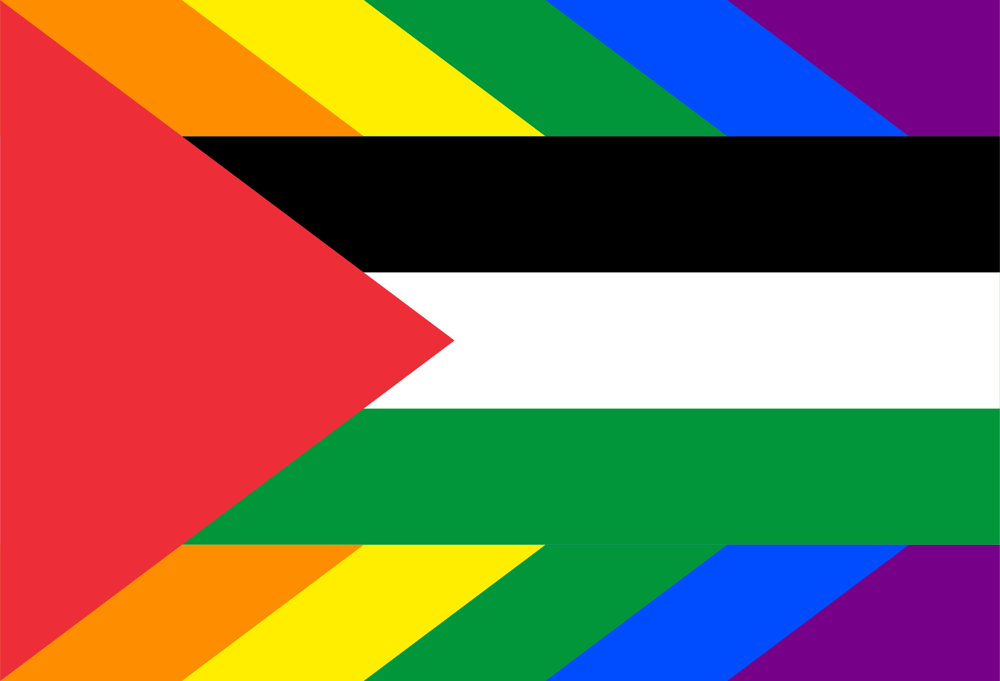
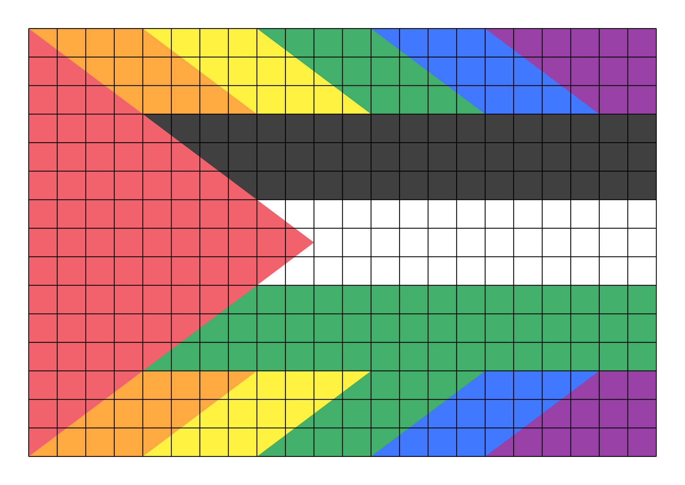

# Palestinian Gay Pride Flag 🇵🇸🏳️‍🌈
I first saw this design at a Brooklyn Rally and [posted on Reddit](https://www.reddit.com/r/QueerVexillology/comments/17iuy1h/queers_for_palestine_from_102823_brooklyn_rally/), and tried for a while to find the original creator of the flag, but had no luck. So I decided to design one myself. I based this design on the [flag of Palestine](https://commons.wikimedia.org/wiki/File:Flag_of_Palestine.svg) and used the colors of the [rainbow pride flag](https://commons.wikimedia.org/wiki/File:Gay_Pride_Flag.svg), but kept the red and green from the flag of Palestine.

## Construction
I started by drawing a sketch of the design I wanted. The flag of palesting is a horizontal tricolor with a proportion of 2:1. This flag has a proportion of 22:15 because I added two more stripes of the same height and expanded the triangle keeping its aspect ratio. See this for the construction:

